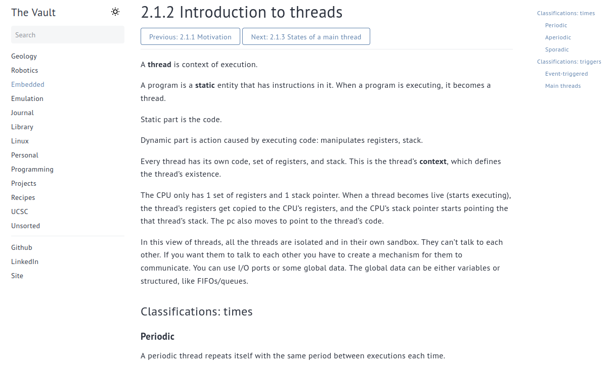

# Hugo book theme

This is a fork of alex-shpak's [Hugo Book theme](https://github.com/alex-shpak/hugo-book) modified to better support the practice of [digital gardening](https://maggieappleton.com/garden-history)/second-braining/custom Wikipedia-ing/whatever you want to call it.

## Some stuff I've added
- Light/dark mode toggle
- Custom layouts
    - For my [rock collection](https://vault.garado.dev/collection/001/) 😎
    - For autosorting my reading list by author, genre, rating, and title

- Auto navigate between pages in sections

